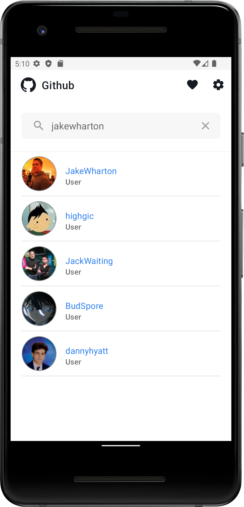

# Github App
Completed submission for modul "Belajar Fundamental Aplikasi Android" in program "Magang dan studi independen bersertifikat" (MSIB) batch 3.

## Disclaimer ⚠️
This repository is created for sharing and educational purposes only. Plagiarism is unacceptable and is not my responsibility as the author.

## Installation
There are several stages for application installation.
1. Star this repository.
2. Cloning this repository to android studio.
```git
git clone https://github.com/rezacahyono/GithubApp.git
```
3. Create your github api key.
> You can find tutorial get api key [here](https://www.dicoding.com/blog/apa-itu-rate-limit-pada-github-api/).
> After getting the api key you can put it in the local.properties file like so:
```gradle
GITHUB_API_KEY = PUT_HERE
```
4. clean and assemble

## Screenshot
|                |                               |
|----------------|-------------------------------|
|||
|||
|||
|||